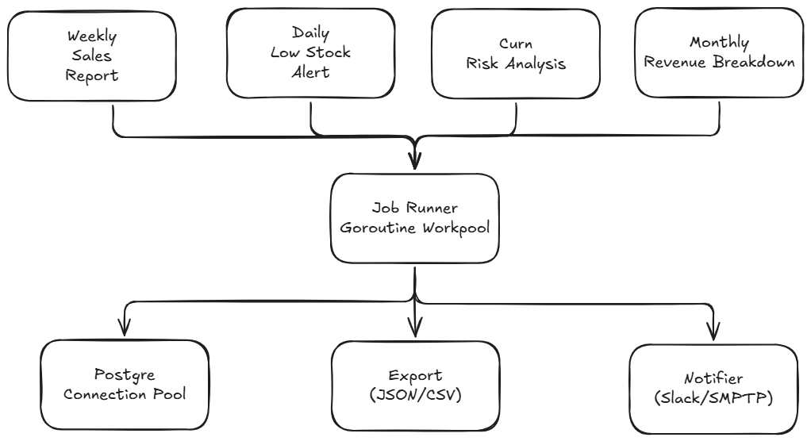

# Automation Design Document

## 3.1 Automation Opportunity Identification

### Approach

All four manual requests follow the same pattern — they're scheduled, repetitive, and the output format doesn't change. So instead of writing 4 separate scripts, I'd build one Go service that treats each report as a "job" with its own cron schedule.

Why one service? They all share the same DB connection, export logic, and notification channels. Splitting them into separate scripts just means maintaining 4 copies of the same boilerplate.

### Architecture



### Technology Choices

| Component | Choice | Why |
|-----------|--------|-----|
| **Scheduler** | System cron + Go binary | Cron is simple and it works. Been around for decades. Could also use `robfig/cron` if we want it self-contained. |
| **Runtime** | Go | Already using it for this project. Compiles to a single binary, goroutines handle concurrency well. |
| **Database** | PostgreSQL connection pool | Go's `sql.DB` handles pooling out of the box. No reason to add anything on top. |
| **Notification** | Slack webhook + email | Slack is just an HTTP POST, no libraries needed. Email as backup for critical stuff. |
| **Output** | Local filesystem, maybe S3 later | Keep it simple. Write to disk with timestamps. Add S3 upload when someone actually asks for it. |
| **Monitoring** | Structured logging | Log to stdout, pipe to whatever log aggregator is already in use. No need for a custom dashboard on day one. |

### Prioritization

I'd start with **Low Stock Alert** because:

1. It runs daily — most manual effort saved
2. Missing a stockout alert means lost sales, so the business impact is immediate
3. The SQL already exists (Query 5 in `queries.sql`), and the output is simple enough to send via Slack
4. Building this first gives us the scheduler + DB + notification plumbing that the other 3 reports can reuse

After that: Weekly Sales → Customer Churn → Monthly Revenue.

### Scalability: 10 Concurrent Reports

This scales to 10 reports without much extra work:

1. **Goroutine worker pool** — jobs go into a buffered channel, N workers pull from it. Start with 5 workers (matching the idle DB connections).

```go
type JobQueue struct {
    jobs    chan Job
    workers int
    db      *database.DB
}

func (q *JobQueue) Start() {
    for i := 0; i < q.workers; i++ {
        go func(workerID int) {
            for job := range q.jobs {
                log.Printf("Worker %d executing: %s", workerID, job.Name)
                job.Execute(q.db)
            }
        }(i)
    }
}
```

2. **Connection pool** — `MaxOpenConns = 10` so we don't overwhelm the DB even if everything runs at once.

3. **Stagger the schedule** — don't fire all reports at the same minute.

```
0  8 * * 1  /usr/local/bin/reporter --report=weekly-sales      # Monday 08:00
5  8 * * *  /usr/local/bin/reporter --report=low-stock-alert   # daily 08:05
10 8 * * *  /usr/local/bin/reporter --report=churn-risk        # daily 08:10
0  9 1 * *  /usr/local/bin/reporter --report=monthly-revenue   # 1st of month 09:00
```

4. **Timeouts** — each job gets a context with a deadline. A slow query won't hold up the whole queue.

---

## 3.2 Query Performance Debugging

### The Query

```sql
SELECT
    c.name,
    c.email,
    COUNT(o.id) as order_count,
    SUM(o.total_amount) as total_revenue
FROM customers c
LEFT JOIN orders o ON c.id = o.customer_id
WHERE o.order_date >= '2024-01-01'
GROUP BY c.id, c.name, c.email
HAVING COUNT(o.id) > 5
ORDER BY total_revenue DESC;
```

### Why It's Slow

A few things stack up here:

1. **No index on `order_date`** — PostgreSQL scans all 15M rows in `orders` to find the ones after 2024-01-01. That alone could take most of those 45 seconds.

2. **No index on `customer_id` in orders** — the join between 2M customers and 15M orders has to use a hash join or (worse) nested loops. Both are expensive without an index.

3. **The LEFT JOIN is pointless** — `WHERE o.order_date >= '2024-01-01'` already filters out customers with no orders (their `order_date` would be NULL, which fails the WHERE). So it's acting like an INNER JOIN but PostgreSQL might not optimize it that way.

4. **Sorting everything** — `ORDER BY total_revenue DESC` with no `LIMIT` means it sorts the full result set, which could mean spilling to disk.

5. **GROUP BY on text columns** — grouping on `c.name` and `c.email` (VARCHAR 255) is slower than just grouping on the integer PK.

### Quick Fixes

**Indexes:**

```sql
CREATE INDEX idx_orders_order_date ON orders (order_date);
CREATE INDEX idx_orders_customer_id ON orders (customer_id);

-- best for this specific query
CREATE INDEX idx_orders_customer_date ON orders (customer_id, order_date);
```

**Switch to INNER JOIN** — since the WHERE already excludes customers without matching orders, INNER JOIN gives the planner more options.

**GROUP BY `c.id` only** — the PK guarantees name and email are unique per group. PostgreSQL allows this since 9.1.

### Long-term Fixes

1. **Partition `orders` by date** — range partitioning by month or quarter. Queries that filter by date only scan relevant partitions.

```sql
CREATE TABLE orders (
    id SERIAL,
    customer_id INT REFERENCES customers(id),
    order_date TIMESTAMP NOT NULL,
    status VARCHAR(50),
    total_amount DECIMAL(10,2)
) PARTITION BY RANGE (order_date);

CREATE TABLE orders_2024_q1 PARTITION OF orders
    FOR VALUES FROM ('2024-01-01') TO ('2024-04-01');
-- etc.
```

2. **Materialized view** — if this report runs regularly, pre-compute it and refresh daily.

```sql
CREATE MATERIALIZED VIEW mv_customer_order_summary AS
SELECT
    c.id AS customer_id, c.name, c.email,
    COUNT(o.id) AS order_count,
    SUM(o.total_amount) AS total_revenue,
    MAX(o.order_date) AS last_order_date
FROM customers c
INNER JOIN orders o ON c.id = o.customer_id
WHERE o.status = 'completed'
GROUP BY c.id, c.name, c.email;

REFRESH MATERIALIZED VIEW CONCURRENTLY mv_customer_order_summary;
```

3. **Covering index** — if we want index-only scans:

```sql
CREATE INDEX idx_orders_covering ON orders (customer_id, order_date)
    INCLUDE (total_amount, id);
```

### Optimized Version

```sql
SELECT
    c.name,
    c.email,
    COUNT(o.id)          AS order_count,
    SUM(o.total_amount)  AS total_revenue
FROM customers c
INNER JOIN orders o ON c.id = o.customer_id
WHERE o.order_date >= '2024-01-01'
GROUP BY c.id, c.name, c.email
HAVING COUNT(o.id) > 5
ORDER BY total_revenue DESC;
```

With `idx_orders_customer_date` in place, this should go from ~45s down to 1-3s.

---

## 3.3 REST API Integration

### What's Implemented

This is already built into the Go tool:
- `internal/api/client.go` — HTTP client with 3 retries and exponential backoff
- `cmd/main.go` — the `daily-sales-api` command pulls data from DB, builds the JSON payload, and POSTs it

### How to Use

```bash
# send yesterday's report (default)
go run cmd/main.go --config=config.json --report=daily-sales-api

# send for a specific date
go run cmd/main.go --config=config.json --report=daily-sales-api --start-date=2024-11-29
```

### Scheduling

**Linux/macOS:**
```cron
0 8 * * * /usr/local/bin/reporter --config=/etc/reporter/config.json --report=daily-sales-api >> /var/log/reporter/daily-sales.log 2>&1
```

**Windows:**
```
schtasks /create /tn "DailySalesReport" /tr "D:\path\to\reporter.exe --config=config.json --report=daily-sales-api" /sc daily /st 08:00
```

**Docker:**
```dockerfile
FROM golang:1.22-alpine AS builder
WORKDIR /app
COPY . .
RUN go build -o /reporter ./cmd/main.go

FROM alpine:3.19
COPY --from=builder /reporter /usr/local/bin/reporter
COPY config.json /etc/reporter/config.json
COPY crontab /etc/crontabs/root
CMD ["crond", "-f"]
```

### Error Handling

- **Network errors** — retry up to 3x with increasing backoff (2s, 4s, 6s)
- **4xx** — don't retry (except 429). Usually means the payload or auth is wrong, retrying won't fix it
- **5xx** — retry, the server is probably having a temporary issue
- **Timeout** — 30s per request
- **Logging** — every attempt gets logged (success or failure) so we can trace what happened
